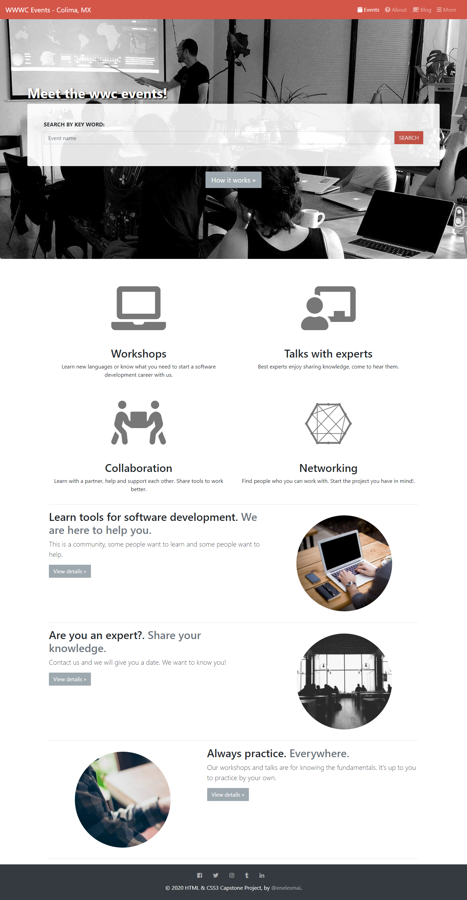
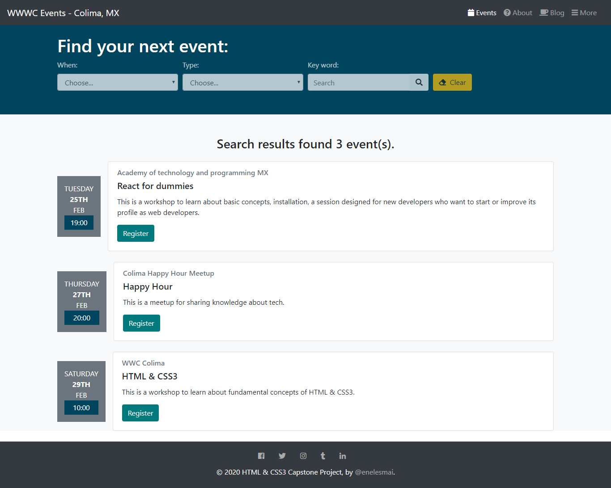
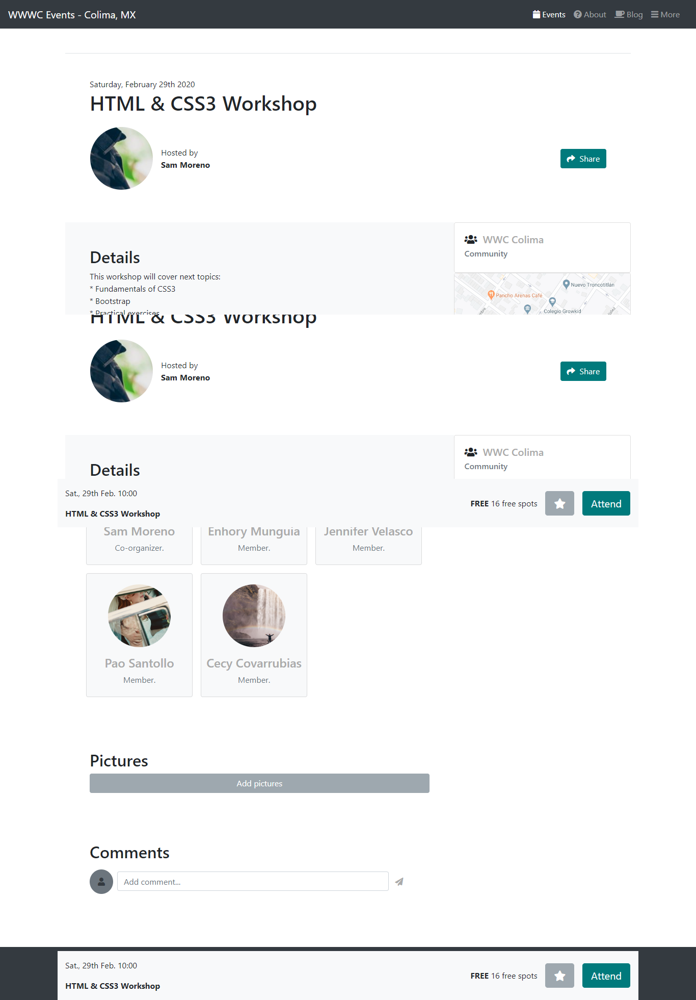

# CapstoneProject-HTMLCSS3
An HTML/CSS real-world solo project.

* It's a real-world-like project, built with business specifications t

## Built With

- CSS3 and HTML
- Bootstrap 4
- Media queries
- FlexBox Model
- Javascript

## Live Demo

[Click here](https://raw.githack.com/enelesmai/CapstoneProject-HTMLCSS3/development/index.html) for live demo

## Getting Started

**This is a static page and was made using  CSS & HTML, you don't need .**
**anything to start up this page, it is already published in a public repository so you can check the final result.**

## Author

👤 **Xóchitl Selene**

- GitHub: [@enelesmai](https://github.com/enelesmai)
- Twitter: [enelesmai](https://twitter.com/enelesmai)
- LinkedIn: [xochitl-selene](https://www.linkedin.com/in/xochitlselene/)

## 🤝 Contributing

Contributions, issues and feature requests are welcome!

## Show your support

Give a ⭐️ if you like this project!

## Acknowledgments

* Hat tip to anyone whose code was used
* Inspiration
* etc

## 📝 License

This project is [MIT](lic.url) licensed.